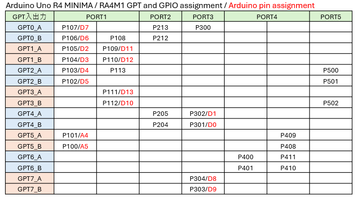

# Arduino_UNO_R4_GPT_PWM_Examples

## 目的 / Purpose
このリポジトリは、Arduino UNO R4 (RA4M1) でPWM信号を生成する色々な方法を示しています。  
例は単純なものから高度なものへと進み、複雑さが増えますがユーザーができる制御レベルも向上します。  
This repository demonstrates different methods for generating PWM signals on the Arduino UNO R4 (RA4M1).  
The examples progress from simple to advanced, increasing both complexity and the level of control available to the user.  

---

## 方法 / Methods
**これらの例はArduino UNO R4 Minimaを対象としています。**  
UNO R4 WiFiでは、ArduinoピンとRA4M1ポートとの割り当てが異なるため、同じコードでも異なる結果になる可能性があります。  
**These examples target the Arduino UNO R4 Minima.**  
On the UNO R4 WiFi, the RA4M1 port assignment for Arduino pins differs, which may lead to different behavior even when running the same code  

1. **analogWrite** `pwm_by_analogWrite.ino`  
   - 高レベルArduino API / High-level Arduino API  
   - GPTチャネル間で安全に共有 / GPT channels are shared safely  
   - 同一GPT使用により出力の自動的な同期 / Outputs are automatically synchronized between pins that use the same GPT  
   - 従来Arduinoの挙動との互換性を反映 / Maintains compatibility with classic Arduino behavior  
   - おまけ：`knight_rider_by_analogWrite.ino`  ハードウェア詳細を隠蔽した高レベル抽象化のデモ  
     Option: `knight_rider_by_analogWrite.ino` demonstrates how high-level abstraction hides hardware resource details  

LED順次点灯中の動画 / video showing the LED scanning  
  
 

2. **pwm.h Basic** `pwm_by_pwmlib.ino`  
   - 中レベルArduino API / Mid-level Arduino API  
   - 1つのGPTにつき1出力 / Single GPT per output  
   - GPT間の同期は非保証 / No guarantee of phase synchronization between one GPT and another  
 

3. **pwm.h + ELC** `pwm_by_pwmlib_with_sync.ino`  
   - GPTタイマーはイベントリンクコントローラと連携可能 / GPTs can be linked via Event Link Controller  
   - 非同期のPWMを同期化 / Non-synchronized PWM becomes synchronized  
   - RA4M1の特有の機能をデモンストレーション / Demonstrates RA4M1-specific features  
 

4. **FspTimer.h** `pwm_by_fsptimerlib.ino`  
   - GPTの構成にしたがった低レベルAPI / Low-level API in accordance with GPT configuration  
   - GPTのハードウェアの完全なコントロール / Full control over GPT hardware  
   - 同一GPT使用により2つのPWM出力チャネルの自動的な同期 / Two PWM channels are automatically synchronized between pins that use the same GPT  

動作中の動画 / video showing the behavior (Japanese caption only)  
  
 

5. **FspTimer + PWM extended configuration access** `pwm_by_fsptimerlib_on_triangle-wave.ino`  
   - アドバンストPWM（三角波ベースPWM、デッドタイム） / Advanced PWM (triangular wave based and dead-time)  
   - ライブラリの限界とPWM拡張設定の必要性をデモンストレーション / Demonstrates library limitations and necessity of PWM extended configuration access  

動作中の動画 / video showing the behavior (Japanese caption only)  
  
 

---

## ピン接続 / Pin connection
- PWM出力ピンをオシロスコープのプローブに接続する  
- Connect PWM signal pins to probes of oscilloscope  

---

## ポイント / Key insights
GPTタイマーのインプットキャプチャ・コンペアマッチレジスタGTCCRAとGTCCRBと入出力ピンのつながりは、RA4M1ではあまり自由に選択できません。  
**Arduino UNO R4 MINIMA**におけるGPT-ピン接続を下に示します。  
On the RA4M1, the mapping between GPT compare registers (GTCCRA / GTCCRB) and the actual I/O pins is not freely selectable.  
The GPT–pin assignment for the **Arduino UNO R4 MINIMA** is shown below.  

  

---

## 必要な環境 / Requirements
- Arduino IDE（最新版推奨） / Arduino IDE (latest recommended)  
- Arduino UNO R4 MINIMA / Arduino UNO R4 MINIMA  

---

## License
Copyright (c) 2026 inteGN - MIT License  

